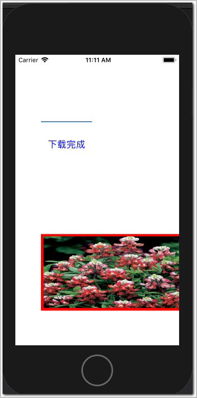

# iOS_Best_Practice


## [创建项目并集成LeanCloud SDK](https://github.com/CoderDream/iOS_10_Development_QuickStart_Guide/blob/master/chapter01.md)  

  
-  参考文档：  
	1. [创建项目并集成LeanCloud](https://github.com/CoderDream/iOS_10_Development_QuickStart_Guide/blob/b61a0bfa2afb149bb9ca9cfa8e2e91d8befbdbe7/BookAssets/%E6%BA%90%E4%BB%A3%E7%A0%81/%E7%AC%AC1%E7%AB%A0/README.md)  
	2. [Swift SDK 安装指南](https://tab.leancloud.cn/docs/start.html)  
	3. [数据存储开发指南 · Swift](https://leancloud.cn/docs/leanstorage_guide-swift.html)  


### [Swift基础之使用Alamofire库进行网络请求和断点下载](https://blog.csdn.net/hbblzjy/article/details/53392135)

- 模拟器：  


- 控制台输出：  
```
当前进度：4.308857563644014%
当前进度：8.617715127288028%
当前进度：25.853145381864085%
当前进度：30.1620029455081%
当前进度：34.47086050915211%
当前进度：38.77971807279613%
当前进度：43.08857563644014%
当前进度：47.39743320008415%
当前进度：51.70629076372817%
当前进度：64.63286345466021%
当前进度：73.25057858194825%
当前进度：77.55943614559226%
当前进度：81.86829370923627%
当前进度：90.4860088365243%
当前进度：100.0%
输出此时下载的地址位置。。。。。
file:///var/mobile/Containers/Data/Application/85E245BA-3ABB-4362-A379-269C3023293C/Documents/AlamoFire.jpg
文件下载完毕: SUCCESS: 380240 bytes
```