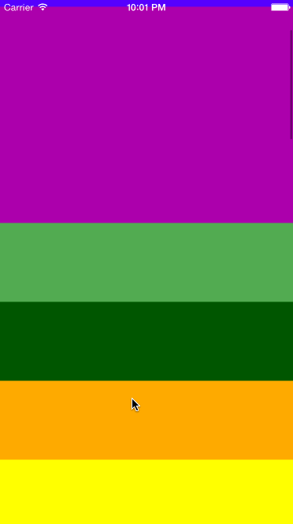
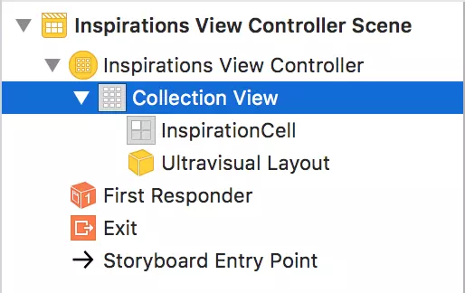
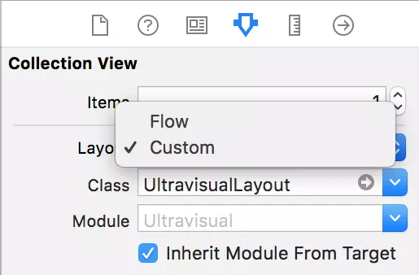

### Creating Multiple Cell Sizes - 创建多个单元格大小

首先，将创建特色单元格。 它大约是标准单元格的两倍，因此用户可以清楚地看到选择了哪个项目。

跳转到UltravisualLayout.swift并转到prepare（）。 在这行代码之后：
```swift
cache.removeAll(keepingCapacity: false)
```
添加一些您将在每个item中使用的新局部变量：

```swift
let standardHeight = UltravisualLayoutConstants.Cell.standardHeight
let featuredHeight = UltravisualLayoutConstants.Cell.featuredHeight
    
var frame = CGRect.zero
var y: CGFloat = 0
```  
接下来，添加以下代码以遍历collection view中的每个item并相应地调整item的状态：  
```swift
for item in 0 ..< numberOfItems {
  // 1 创建当前单元格的索引路径，然后为其创建默认属性
  let indexPath = IndexPath(item: item, section: 0)
  let attributes = UICollectionViewLayoutAttributes(forCellWith: indexPath)
  
  // 2 设置z轴
  attributes.zIndex = item
  var height = standardHeight
  
  // 3 确定当前单元格的状态 - featured, next or standard
  if indexPath.item == featuredItemIndex {
    // 4 如果单元格当前处于特征单元格位置，则计算 yOffset 并使用该值来计算得到单元格的新 y 值。
    // 之后，将单元格的高度设置为特征高度。
    let yOffset = standardHeight * nextItemPercentageOffset
    y = collectionView!.contentOffset.y - yOffset
    height = featuredHeight
  } else if indexPath.item == (featuredItemIndex + 1) && indexPath.item != numberOfItems {
    // 5 如果单元格在下一行，则首先计算最大 y 可能（在这种情况下，大于特征单元格）并将其与计算高度结合，最终得到正确的 y 值。
    let maxY = y + standardHeight
    height = standardHeight + max((featuredHeight - standardHeight) * nextItemPercentageOffset, 0)
    y = maxY - height
  }
  // 6 为每个单元格设置一些公共元素
  // 创建 frame
  frame = CGRect(x: 0, y: y, width: width, height: height)
  // 设置计算的属性
  attributes.frame = frame
  // 更新缓存
  cache.append(attributes)
  // 更有 y
  y = frame.maxY
}
```  

要使collection view知道要使用哪个布局，需要告诉UICollectionView使用UltravisualLayout作为其布局类。
首先，打开Main.storyboard并选择Document Outline中的Collection View。

接下来，打开Attributes inspector并将Layout下拉列表设置为Custom，然后将Class设置为UltravisualLayout。


最后，在构建之前，转到InspirationsViewController.swift，并在viewDidLoad（）中删除最后两行：
```swift
let layout = collectionViewLayout as! UICollectionViewFlowLayout
layout.itemSize = CGSize(width: collectionView!.bounds.width, height: 100)
```
这两行是显示同样大小的多色单元格的基本布局。 现在已经在UltravisualLayout中指定了布局代码并在故事板中设置了自定义布局类，您不再需要这些行。
构建并运行，你会看到我们想要的结果

  

  

  

  

请注意，顶部单元格要大得多，有效地展示了一个特色单元格。滚动时，特色单元格下方的单元格会扩展并重叠当前的特征单元格。多棒的效果！


